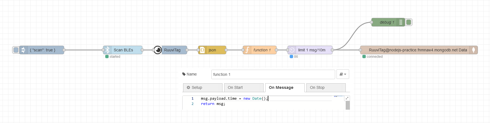

# Refrigeradar

'**Refrigeradar**' on yhdistetty Internet of Things ja Full Stack -projekti.  
RuuviTag Bluetooth-sensori mittaa ja lähettää jääkaappini olosuhteita reaaliaikaisesti.  
Raspberry Pi 3 -tietokone vastaanottaa ja lähettää dataa 10 minuutin välein MongoDB tietokantaan.  
NodeJS -serveri noutaa datan tietokannasta ja piirtää sen loppukäyttäjälle.

